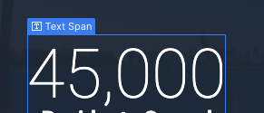
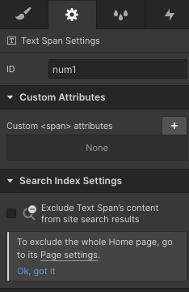
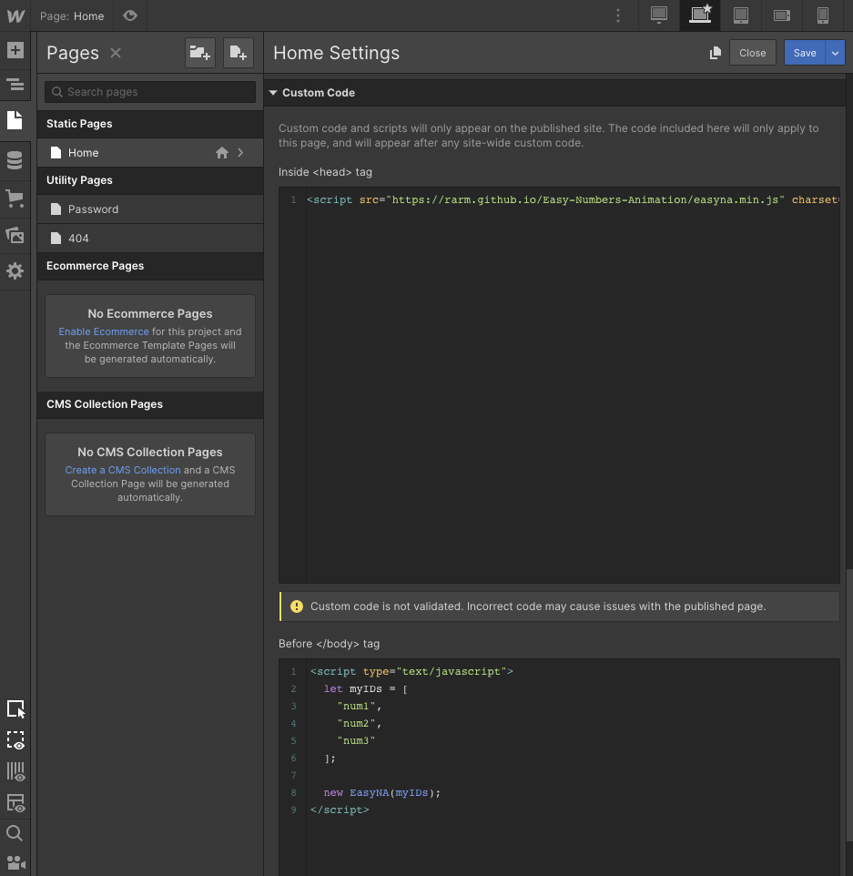

# Easy Numbers Animation
If you want a simple tool to animate the numbers in your webpage, follow the instructions below!

### Steps to use

###### Add JS to your page
```html
<!-- Add this in the header or before using it. -->
<script src="https://rarm.github.io/Easy-Numbers-Animation/easyna.min.js" charset="utf-8"></script>
```

###### Create instance of EasyNA
```html
<!-- Wrap the numbers in a span and give them unique IDs. -->
<p>My number: <span id="num1">15,000</span>.</p>
<p>My second number: <span id="num2">35,000</span>.</p>
<p>My third number: <span id="num3">88,005,000</span>.</p>

<!-- Create an array with all the IDs. -->
<script type="text/javascript">
  let myIDs = [
    "num1",
    "nun2",
    "num3"
  ];

  // Create an instance, and pass the array with the IDs as the argument.
  new EasyNA(myIDs);

  // All done.
  // EasyNA will take care of add the commas as thousand separators.
</script>
```

### How to add them to Webflow
As when it is done in the HTML, add the ID to the span elements where the number are. Be sure that only the number (and only one number) is inside the span element.



Add unique IDs to the span elements.



Finally, as presented in the example above, add first the link to the script in the header, and then create an array containing the IDs as strings, and pass this array as an argument to EasyNA.


